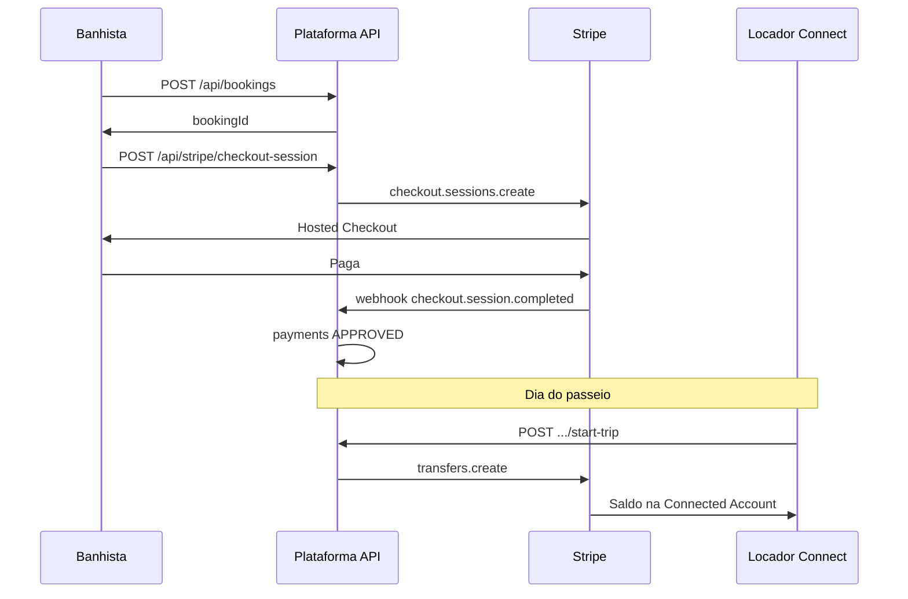

# Alto Mar — Desenho de integração Stripe (reserva + checkout)

Documento de referência para alinhar o fluxo de pagamento Stripe ao que já existe com Mercado Pago (`Reservar` → `POST /api/bookings` → checkout externo).

---

## 1. Fluxo actual (Mercado Pago — resumo)

1. Banhista confirma no front (`Reservar.tsx`).
2. Front chama `POST /api/bookings` (JWT) → API cria reserva em estado **PENDING** na PostgreSQL.
3. Front chama `POST /api/mercadopago/preference` com `bookingId`, valor, dados do pagador.
4. API cria **preferência** no MP; devolve `init_point` / `sandbox_init_point`.
5. Front abre essa URL (nova janela ou mesmo separador).
6. Pagamento concluído no site do Mercado Pago; `back_urls` redireccionam para `/reservar/sucesso`, `/reservar/erro`, `/reservar/pendente`.

---

## 2. Fluxo proposto — Stripe Checkout (recomendado)

Espelha o MP: redirect para página hospedada pelo Stripe (menos PCI no teu código).

**Regra de produto (Alto Mar):** o banhista **paga primeiro** (reserva ainda **PENDING** ou já **ACCEPTED**). O repasse ao locador ocorre após a realização do serviço (fluxo Connect existente). Se o armador **recusar** uma reserva já paga, faz-se **reembolso** Stripe. Se existirem **várias reservas PENDING no mesmo dia** para o mesmo barco e o armador **aceitar uma**, as outras são **canceladas automaticamente**; quando havia pagamento Stripe, é **devolvido** ao banhista, com mensagem institucional na conta (código `renter_notice_code` + i18n).

1. Banhista confirma no front.
2. `POST /api/bookings` → reserva **PENDING**, resposta com `bookingId`.
3. `POST /api/stripe/checkout-session` (JWT) com `bookingId` (e validação no servidor do valor `total_cents` da reserva) — **permitido em PENDING ou ACCEPTED** (pagamento antes da aceitação do armador).
4. API chama `checkout.sessions.create` com:
   - `metadata.booking_id` e/ou `client_reference_id` = UUID da reserva;
   - `success_url` / `cancel_url` usando `FRONTEND_URL` (ex.: `/reservar/sucesso`, `/reservar/erro`);
   - linha(s) de produto ou `amount` em centavos, moeda **BRL** (conforme conta Stripe).
5. API regista ou actualiza linha em **`payments`** (provider STRIPE, id da sessão, estado CREATED).
6. Front recebe `{ url }` e redirecciona (`window.location` ou `window.open`).
7. Utilizador paga no Stripe.
8. Stripe envia **`POST /api/stripe/webhook`** com assinatura; tratas `checkout.session.completed` de forma **idempotente** e actualizas `payments.status` (ex.: SUCCEEDED).
9. Opcional: página de sucesso chama `GET /api/stripe/session-status` para UX, mas a **fonte de verdade** é o webhook (e/ou `sessions.retrieve` no servidor).

**Importante:** não confiar apenas no redirect de sucesso; o webhook (ou verificação server-side da sessão) evita estados incorrectos.

---

## 3. Endpoints da API (Node)

| Método | Rota | Autenticação | Função |
|--------|------|--------------|--------|
| POST | `/api/stripe/checkout-session` | JWT (banhista) | Valida que a reserva pertence ao utilizador, estado e montante; cria sessão Stripe; persiste `payments`. |
| POST | `/api/stripe/webhook` | Stripe (`Stripe-Signature`) | Corpo em **raw body**; valida assinatura com `STRIPE_WEBHOOK_SECRET`; processa eventos. |
| GET | `/api/stripe/session-status` (opcional) | JWT | Confirma `payment_status` da sessão para a página de sucesso. |
| POST | `/api/renter/bookings/:id/cancel` | JWT (banhista) | Cancela reserva `PENDING`/`ACCEPTED`; para `ACCEPTED` exige `reason` (mín. 10 chars) e aplica política de reembolso por prazo (Stripe). |

---

## 4. Base de dados — tabela `payments`

- Acrescentar valor **`STRIPE`** ao enum `payment_provider` (migração SQL).
- Reutilizar `booking_id`, `status`, timestamps.
- Guardar identificador da sessão Stripe (coluna dedicada ou campo genérico `external_checkout_id` se refactorizares o que hoje é `mp_preference_id`).

**Nota:** no código actual, o fluxo MP pode ainda não preencher `payments` em todos os passos; o Stripe é boa oportunidade para registar pagamento à criação da sessão e fechar no webhook.

---

## 5. Variáveis de ambiente

**Servidor (`server/.env`):**

- `STRIPE_SECRET_KEY` — `sk_test_…` / `sk_live_…`
- `STRIPE_WEBHOOK_SECRET` — `whsec_…`
- `FRONTEND_URL` — já usado para `back_urls` do MP; reutilizar para `success_url` / `cancel_url` do Stripe
- `STRIPE_PIX_ENABLED` — `1` para habilitar PIX no Checkout (no momento, pode ficar desligado por operação).
- `STRIPE_SKIP_PIX_PMC` — `1` para não tentar ligar PIX via Payment Method Configurations API.
- `STRIPE_CARD_FEE_PERCENT` — percentual estimado de taxa do gateway para cálculo de parcela não reembolsável.
- `STRIPE_CARD_FEE_FIXED_CENTS` — parcela fixa estimada (centavos) da taxa do gateway.

**Front (opcional):**

- `VITE_STRIPE_PUBLISHABLE_KEY` — só necessário se no futuro usares Stripe.js / Payment Element no browser; com **só** Checkout redirect pode não ser preciso.

---

## 6. Front — `Reservar.tsx`

- Após `criarReserva`, ramo alternativo ao MP:
  - `POST /api/stripe/checkout-session` com `{ bookingId }`;
  - resposta `{ url }` → `window.location.href = url` ou `window.open(url)`.
- Seleção de provider: variável `PAYMENT_PROVIDER=stripe|mercadopago` ou feature flag.

---

## 7. Desenvolvimento local — webhook

- **Stripe CLI:** `stripe listen --forward-to localhost:3001/api/stripe/webhook`
- Em produção (ex.: Railway): registar URL HTTPS no Dashboard Stripe.

---

## 8. Decisões de produto

- **Estado da reserva após pagamento (definido):** o pagamento Stripe **não** altera o estado da reserva por si só; o banhista pode pagar em **PENDING**; o webhook marca `payments` como **APPROVED** e o fluxo financeiro (`stripe_flow_status`, ledger). O armador **só aceita** com `PAYMENTS_PROVIDER=stripe` quando o pagamento já está **APPROVED**.
- **Moeda BRL:** confirmar suporte na conta Stripe (Brasil / multi-moeda).
- **PIX:** depende da oferta Stripe na tua região; no estado atual pode ficar **temporariamente indisponível** no front (`Reservar.tsx`) por flag operacional.

---

## 9. Pagamento antecipado + repasse ao locador (Stripe Connect)

Requisito de produto: o **banhista paga cedo** (tipicamente com a reserva ainda **PENDING**, ou depois se o fluxo o exigir); o **dinheiro só chega à conta bancária do locador** quando o locador indica que **o passeio iniciou** (dia da reserva). Isto implica **Stripe Connect**: a plataforma cobra o cliente; uma parte do valor é repassada à **conta conectada** do locador (`Transfer`), segundo o calendário de *payouts* da conta dele.

**Recusas e conflitos no mesmo dia:** reembolso Stripe (`refunds.create`) quando o armador **recusa** uma reserva já paga; quando o armador **aceita** um pedido e existem outros **PENDING** no mesmo **barco** e **dia**, esses são **cancelados** e, se estavam pagos via Stripe, **reembolsados**. Mensagem ao banhista: ver `renter_notice_code` (`SAME_DAY_OTHER_ACCEPTED`, `OWNER_DECLINED_REFUND`) e chaves i18n em `reservasConta.notice*`.

### 9.1 Por que não basta “Checkout simples”

Um Checkout que deposita tudo na **mesma conta Stripe** da plataforma não coloca o valor “na conta do locador” sem um segundo passo. Para cada locador receber no seu IBAN, precisas de **Connected Account** (Express ou Standard são os mais simples para onboarding).

### 9.2 Modelo recomendado: *separate charge and transfer*

1. **Onboarding do locador** (uma vez): fluxo **Connect Express** → guardas `stripe_account_id` (ex.: `acct_…`) no utilizador locador ou no barco.
2. **Checkout / PaymentIntent** na conta da **plataforma**: montante total em BRL (centavos); define comissão da plataforma (fica na plataforma; o `Transfer` envia só a parte líquida do locador).
3. Cliente paga → webhook confirma → dinheiro na **balanço da plataforma** (disponível conforme regras do Stripe).
4. **No dia do passeio**, o locador usa **“Iniciar passeio”** (novo passo na UI Marinheiro):
   - Servidor valida: reserva **ACCEPTED**, data do passeio, pagamento **APPROVED**, ainda **sem** repasse registado.
   - `stripe.transfers.create` com `destination: stripe_account_id` e ligação ao `charge`/`PaymentIntent` (ex.: `source_transaction` quando aplicável).
5. O locador vê o saldo na **Connected Account**; o envio para o banco é o **payout** automático do Stripe (não é instantâneo — ver documentação *Payouts*).

### 9.3 Alternativa: *destination charge*

Cobrança com `transfer_data.destination` reparte no momento do pagamento. Serve para marketplaces, mas **não** dá o mesmo controlo temporal explícito de “tudo na plataforma até iniciar o passeio”. Para esse controlo, **cobrança na plataforma + Transfer no evento** é mais claro.

### 9.4 *Manual capture*

`capture_method: manual` autoriza no checkout e **captura** ao iniciar o passeio. A percepção do cliente (“cobrado já”) pode diferir do cartão em relação à captura automática + Transfer; escolhe conforme jurídico/produto.

### 9.5 Estados da reserva e gatilho

O Marinheiro tem hoje aceitar e **marcar concluído**. Para este fluxo:

- Acrescentar estado **`IN_PROGRESS`** ou um campo `trip_started_at` / `stripe_transfer_id` para não duplicar repasses.
- **Gatilho do `Transfer`:** `POST /api/owner/bookings/:id/start-trip` (botão “Passeio iniciado”), alinhado ao requisito “quando iniciou”.
- **Idempotência:** só criar `Transfer` se ainda não existir `stripe_transfer_id` persistido.

### 9.6 Dados a persistir (além da secção 4)

| O quê | Onde |
|--------|------|
| `stripe_account_id` do locador | `users` ou `boats` |
| `stripe_payment_intent_id` / charge | `payments` |
| `stripe_transfer_id` | `payments` (ou tabela `payouts`) |
| `trip_started_at` | `bookings` (recomendado) |

### 9.7 Endpoints (rascunho)

| Método | Rota | Função |
|--------|------|--------|
| GET | `/api/owner/stripe/connect-link` | Account Link (onboarding Express). |
| GET | `/api/owner/stripe/connect-status` | `charges_enabled` / `payouts_enabled`. |
| POST | `/api/owner/bookings/:id/start-trip` | Validações + `Transfer` + atualização de estado. |

### 9.8 Diagrama (visão geral)

### 9.9 Cancelamentos e reembolsos

Implementação atual para reservas **já ACCEPTED** canceladas pelo banhista (Stripe):

- **7+ dias de antecedência**: reembolso do valor pago **deduzidas taxas não reembolsáveis** (plataforma + gateway), via `stripe.refunds.create(amount=...)`.
- **Entre 6 e 2 dias**: reembolso de **50%** do valor do serviço.
- **Menos de 48h / no-show**: **sem reembolso**.

Notas técnicas:

- O cálculo de janela usa `booking_date + embark_time` (fallback `09:00` quando sem hora definida).
- Para cancelamento `ACCEPTED`, a API exige `reason` com mínimo de 10 caracteres.
- O sistema persiste `bookings.renter_notice_code` para mensagem institucional no painel do banhista:
  - `RENTER_CANCEL_FULL_FEE_DEDUCTED`
  - `RENTER_CANCEL_PARTIAL_50`
  - `RENTER_CANCEL_NO_REFUND_LT48H`
- Reembolsos de recusa do armador e auto-cancelamento por conflito de data já existentes:
  - `OWNER_DECLINED_REFUND`
  - `SAME_DAY_OTHER_ACCEPTED`
- **Semântica de status em `payments`:**
  - estorno **total** → `payments.status = REFUNDED`;
  - estorno **parcial** → mantém estado de cobrança aprovado (não vira `REFUNDED`).

Recusa/cancelamentos do lado do armador continuam a usar `stripe.refunds.create` conforme regras de negócio da plataforma.

---

## 10. Implementação sugerida em fases (actualizado)

**Fase A — Base Stripe**  
Migração `payments` + `checkout-session` + webhook; `Reservar.tsx` + `.env.example`.

**Fase B — Connect**  
`stripe_account_id`; onboarding; opcionalmente bloquear checkout se o locador não estiver pronto a receber.

**Fase C — Repasse**  
Estado ou timestamp de início; `POST …/start-trip` + `Transfer` idempotente; botão “Passeio iniciado” no Marinheiro.

**Fase D — Operação**  
Webhooks, comissão, disputas e suporte documentados.

---

## 11. Revisão técnica marketplace (checklist de produção)

Pontos alinhados a uma revisão externa do fluxo (*Stripe Marketplace Flow — Technical Review*; ficheiro de referência: `stripe_marketplace_review.pdf`).

### 11.1 Já reflectidos no desenho Alto Mar

| Ponto | Notas |
|--------|--------|
| Separação domínio vs financeiro | Reserva (`bookings`) vs cobrança (`payments` / futuro `payouts`). |
| Checkout hospedado Stripe | Secção 2 — reduz âmbito PCI. |
| Webhook como fonte de verdade | Secção 2; não confiar só no redirect. |
| Persistir pagamento cedo | Linha em `payments` ao criar sessão. |
| Idempotência (repasse) | Secção 9.5 / `stripe_transfer_id`. |
| Connect *separate charge and transfer* | Secção 9.2 — alinhado à recomendação da revisão. |

### 11.2 Correcções críticas a implementar (obrigatórias)

1. **Idempotency key no Checkout** — Ao chamar `stripe.checkout.sessions.create`, passar `idempotencyKey` estável por reserva (ex.: `checkout_${bookingId}` ou hash de `bookingId` + revisão de preço) para evitar sessões duplicadas em retries.
2. **Validação de preço (anti-tampering)** — O servidor **nunca** confia no `total_cents` enviado pelo front após criar a reserva: recalcula ou lê sempre `total_cents` (e linha de itens) a partir da linha `bookings` / regras de negócio antes de criar a sessão.
3. **Corrida redirect vs webhook** — O utilizador pode chegar à página de sucesso **antes** do webhook. O `GET /api/stripe/session-status` (secção 3) deve fazer *polling* (ou a página consulta em intervalos) até `payment_status` estar resolvido; a UI não deve assumir “pago” só pelo URL.
4. **Idempotência do webhook (BD)** — **Constraint UNIQUE** em `stripe_checkout_session_id` (ou equivalente) na tabela `payments` (ou tabela `stripe_events`); eventos repetidos ignorados de forma segura (*upsert* / *ON CONFLICT DO NOTHING*).
5. **Pagamento vs repasse — tabelas separadas** — A revisão recomenda:
   - **`payments`** — cobrança ao cliente (ligada ao `booking_id`, `payment_intent` / `charge`).
   - **`payouts`** (ou nome equivalente) — cada `Transfer` ao locador: `booking_id`, `stripe_transfer_id`, montantes **gross / comissão / net**, estado, timestamps. Evita misturar semântica numa única linha difícil de auditar.

### 11.3 Considerações Connect (reforço)

- **Disponibilidade do saldo** na conta da plataforma pode ter atraso; o `Transfer` no “início do passeio” pode falhar se o saldo ainda não estiver *available* — tratar erro, *retry* controlado ou notificação ao locador.
- **Disputas / chargebacks** — definir processo (webhook `charge.dispute.*`) e responsabilidade entre plataforma e locador.
- **Comissão explícita** — persistir `amount_gross_cents`, `platform_fee_cents`, `owner_net_cents` por reserva ou por linha de `payouts`.

### 11.4 Estados de reserva sugeridos (evolução do enum)

A revisão propõe um ciclo mais explícito (ajustar à tua UX e migrações):

1. `PENDING_PAYMENT` — reserva criada, checkout ainda não concluído.  
2. `PAID` (ou “pago, a aguardar decisão do locador”) — webhook confirmou pagamento.  
3. `ACCEPTED` — locador aceitou.  
4. `IN_PROGRESS` — passeio iniciado (gatilho do `Transfer`).  
5. `COMPLETED` — passeio concluído.  
6. `CANCELLED` / `DECLINED` — conforme regras actuais.  
7. `REFUNDED` — quando aplicável após `stripe.refunds.create`.

*Nota:* o modelo actual usa `PENDING` sem distinguir “sem pagamento” vs “pago”; migrar com cuidado para não partir fluxos Mercado Pago.

### 11.5 Melhorias avançadas (fases posteriores)

- Expiração da reserva / sessão (ex.: 15 minutos sem pagamento → libertar slot ou cancelar).
- Processamento de webhooks em **fila** (worker) para não bloquear o handler HTTP e permitir *retries*.
- Tabela **`stripe_webhook_events`** (event id, tipo, payload resumido, processado em) para auditoria e *replay* seguro.
- Garantir **um único** `Transfer` por reserva (unique em `booking_id` na tabela `payouts` ou flag imutável).

### 11.6 Conclusão da revisão

Arquitectura considerada **sólida e pronta para produção** após: idempotência (API + BD), validação server-side do valor, fiabilidade do webhook, separação **`payments` / `payouts`**, e tratamento de saldo, disputas e comissões.

---

## 12. Checklist de testes (engenharia)

Fluxos mínimos para regressão:

1. **Checkout Stripe imediato após criar reserva** (`Reservar.tsx`): cria `booking` e redireciona para `checkout-session`.
2. **Webhook/sync de pagamento**: `payments = APPROVED`, `stripe_flow_status = PAID`.
3. **Accept do armador (Stripe)**: bloqueia quando pagamento ainda não está `APPROVED`.
4. **Decline do armador com reserva paga**: cria `stripe_connect_refunds`, `payments = REFUNDED`, `renter_notice_code = OWNER_DECLINED_REFUND`.
5. **Aceitar uma reserva e cancelar outras do mesmo dia**: pendentes do mesmo barco/data viram `CANCELLED` e, se pagas, são reembolsadas.
6. **Cancelamento pelo banhista em `ACCEPTED` com política por prazo**:
   - 7+ dias: reembolso líquido de taxas;
   - 6–2 dias: reembolso 50%;
   - <48h: sem reembolso.
7. **UI banhista**: formulário inline de justificativa obrigatório para cancelar `ACCEPTED` e renderização correta dos `renter_notice_code`.

---

*Documentação do repositório Alto Mar.*
